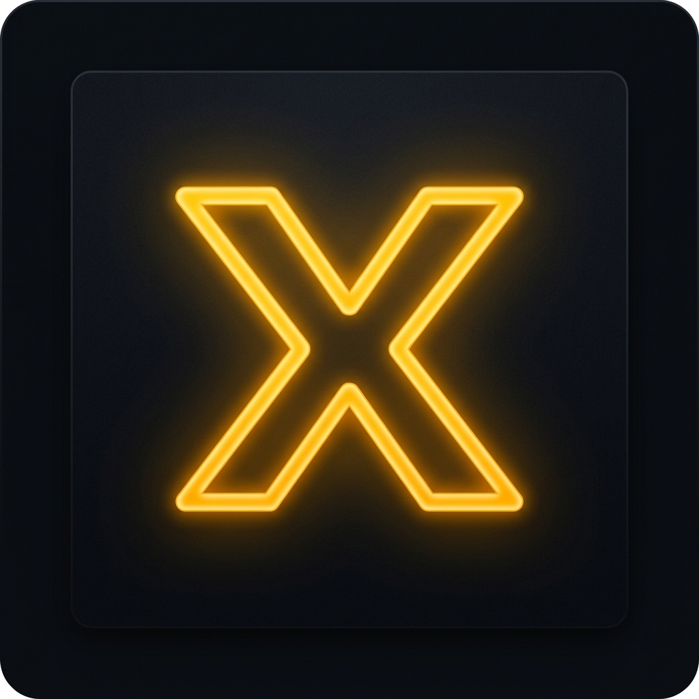

# XECUTE — Do it now. ⚡

> A premium, offline-first Progressive Web App for goal-setting, deep-focus execution, and productivity analytics.



## Features

- **⚡ Execute Tab** — Zero-distraction deep work sessions with a pulsing circular timer, ambient sound, break alerts, and completion tracking
- **📋 Plan Tab** — Full goal → plan → task hierarchy with AI-powered template generation and task breakdown
- **📊 Analyse Tab** — Momentum score, session analytics, velocity charts, AI insights, and milestone badges
- **⚙️ Settings** — Full control over focus preferences, notifications, API keys, and data export
- **🌐 PWA** — Installs from Chrome on Android/iOS, works 100% offline
- **🤖 AI** — Claude for plan templates, task breakdown, insights · Gemini for focus coaching, SMART goals

## Tech Stack

| Area | Technology |
|---|---|
| Framework | React + Vite |
| Styling | Tailwind CSS v4 + custom glassmorphism |
| Storage | Dexie.js (IndexedDB, offline-first) |
| State | Zustand |
| Animations | Framer Motion |
| Charts | Recharts |
| DnD | @dnd-kit |
| PWA | vite-plugin-pwa + Workbox |
| AI | Claude API (Anthropic) + Gemini API (Google) |

## Setup

### 1. Install dependencies

```bash
npm install
```

### 2. Configure API Keys (optional)

Create a `.env.local` file:

```env
VITE_CLAUDE_API_KEY=sk-ant-your-key-here
VITE_GEMINI_API_KEY=AIza-your-key-here
```

Or enter them directly in the app's **Settings → AI Assistant** section.

> **Note:** AI features are fully optional. The app works 100% without API keys.

### 3. Run in development

```bash
npm run dev
```

### 4. Build for production

```bash
npm run build
npm run preview
```

## PWA Installation

1. Open `http://localhost:5173` in Chrome on Android
2. Tap the browser menu → **"Add to Home Screen"**
3. Or use the install prompt that appears in the app (Settings tab)

## Design System

- **Background:** `#0D0F14` (deep charcoal)
- **Accent:** `#F5A623` (amber — action, identity)
- **Secondary:** `#00C9FF` (cyan — analytics, insight)
- **Typography:** Syne (headings) + DM Sans (body)
- **Aesthetic:** Dark glassmorphism — backdrop blur, semi-transparent panels, subtle borders

## Data Privacy

All data is stored locally in IndexedDB. Nothing is sent to any server unless you:
1. Enter API keys (AI calls go to Anthropic/Google directly from your browser)
2. Enable Firebase sync (optional, not enabled by default)

## License

MIT
